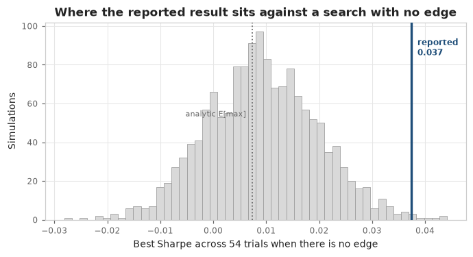
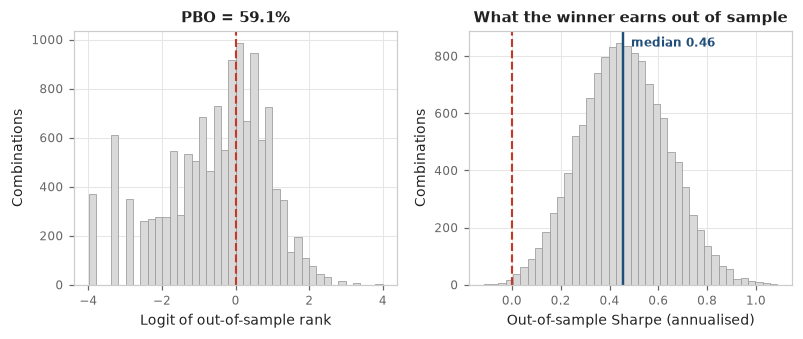
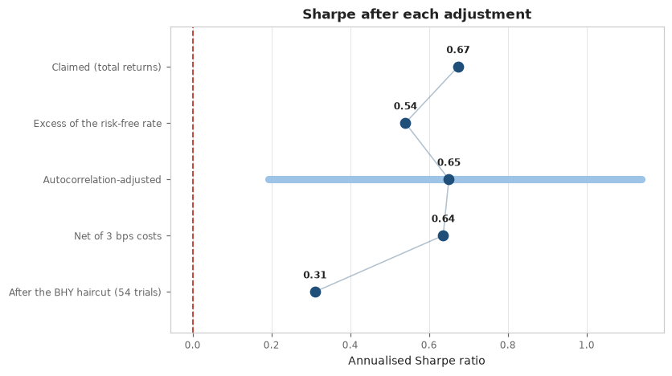
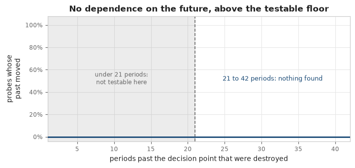
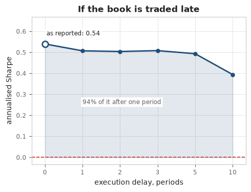
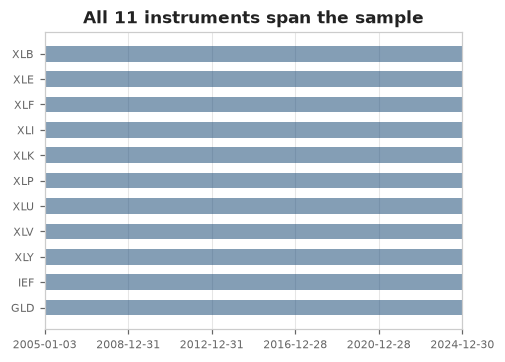

# proper_validation

**An adversarial validator for quantitative backtests.** It attacks a backtest you have already
run and reports how much of the claimed performance survives.

[](https://github.com/honyakgergo/proper-validation/actions/workflows/tests.yml)


---

## The problem

There is no shortage of ways to *run* a backtest. `vectorbt`, `backtesting.py`, `zipline`,
`bt`, QuantConnect — the engines are mature, fast and free, and `quantstats` will render a
beautiful tearsheet of the result.

None of them will tell you whether the result means anything.

That question has been answered, repeatedly and rigorously, over the last twenty years. The
problem is that the answers live in separate journal articles and textbook chapters, each solving
one piece, none of them in the tools people actually use:

| Where the answer lives | What it gives you |
|---|---|
| Lo (2002), *The Statistics of Sharpe Ratios* | A Sharpe ratio has a standard error. Annualising by `sqrt(252)` is wrong when returns are serially correlated. |
| Bailey & López de Prado (2014), *The Deflated Sharpe Ratio* | What a Sharpe ratio is worth once you admit it was the best of N attempts. |
| Bailey, Borwein, López de Prado & Zhu (2015) | Whether your *selection procedure* generalises at all, via combinatorially symmetric cross-validation. |
| Harvey & Liu (2015), *Backtesting* | How much to haircut a t-statistic for multiple testing, and why Bonferroni is the wrong tool. |
| Politis & Romano (1994) | How to bootstrap a serially dependent series without destroying the dependence. |
| Fama & French (2015) | Whether the "alpha" is just factor exposure you could have bought. |
| López de Prado (2018), *Advances in Financial Machine Learning* | Look-ahead, leakage and the many ways a backtest quietly learns the future. |

So a strategy gets built with excellent tooling, evaluated with none, and fails in production — not
because the arithmetic was wrong, but because nobody asked whether a Sharpe of 1.4 chosen from
three hundred variants was distinguishable from luck. **The failure is almost never a bug. It is a
missing question.**

This repository asks the questions. It assumes your arithmetic is correct and attacks everything
else.

It **falsifies; it cannot validate.** There is deliberately no `PASSED` verdict — the best outcome
available is `NOT_FALSIFIED`, *"the tests applied did not break it"*. That is the only claim the
mathematics supports.

---

## Two independent questions

A backtest can fail in two unrelated ways, and one blended verdict hides which happened.

| | **Statistical validation** | **Engine analysis** |
|---|---|---|
| **Asks** | Is the measured edge distinguishable from luck? | Can the backtest be trusted as an implementation? |
| **Fails when** | The edge is selection bias, factor exposure, or eaten by costs | The code reads the future, is not reproducible, or the edge is a timing artifact |
| **Needs** | A return series | A re-runnable strategy |

```bash
qv validate --manifest research_manifest.yaml --suite statistical
qv validate --manifest research_manifest.yaml --suite engine
qv validate --manifest research_manifest.yaml            # both, the default
```

The dangerous case is a **sound-looking number from an unsound implementation**, because nothing in
the return series betrays it.

---

## Setup

Python 3.11 or 3.12. There is no PyPI package — this is a repository you clone and a
[Claude Code](https://claude.com/claude-code) skill you install from it.

**To audit your own research**, which is what almost everyone wants. Your backtest lives in some
other directory, so `qv` has to work from *there*:

```bash
git clone https://github.com/honyakgergo/proper-validation.git
pipx install --editable "proper-validation[data]"     # or: uv tool install --editable ...
qv skill install --user                               # the skill, for every project

cd ~/my-strategy                                      # your research, wherever it lives
qv --help                                             # must work here, not just in the clone
```

`pipx` and `uv` install into an isolated environment and put `qv` on your PATH, so the audit runs
anywhere without adding numpy, pandas, scipy and statsmodels pins to the environment your own
research runs in. **Do not use a virtualenv inside the clone for this** — the command would then
exist only while that environment is active, and the whole point is to run it somewhere else.

Take the `[data]` extra here even though the engine never needs the network: `qv adapter init`
scaffolds a manifest that fetches prices with `yfinance`, so without it the first file the agent
generates cannot run.

Then open Claude Code in your project and ask it to audit your backtest. The skill activates on its
own and carries the audit protocol, the adapter contract, the manifest schema and the findings
catalog, so the agent reads your notebook, lifts the strategy into an adapter, fills in the
manifest, runs deterministic CLI commands and interprets the findings — rather than improvising
statistics.

**To work on the tool itself**, a virtualenv in the clone is right, because you want the tests:

```bash
cd proper-validation
python -m venv .venv
source .venv/bin/activate        # Windows: .venv\Scripts\activate
pip install -e ".[data,dev]"

pytest -q                        # ~950 tests, no network, about a minute
qv demo null_mined               # audit a synthetic strategy with a known-zero edge
```

`data` adds `yfinance`, needed only to *fetch* prices — the statistical core installs and runs with
no network stack at all. `qv demo` writes a self-contained `report.html`; open it to see what the
tool produces.

---

## Using it

**Quickest path** — a return series:

```bash
qv validate returns.csv --trials 40 --positions positions.csv --asset-class us_large_cap_etf
```

`--trials` is how many configurations you examined, *including the ones you threw away*. It is the
most under-reported number in backtesting and the key input to the deflated Sharpe ratio. Overstate
it when unsure; the correction is logarithmic, so honesty is cheap.

**Full path** — a manifest and a thin adapter, which unlocks the engine analysis. `qv adapter init`
writes both to fill in:

```python
def positions(prices: pd.DataFrame, **params) -> pd.DataFrame:
    """Row t is the book held into t+1, so it may use data up to t and no further."""
    score = prices / prices.shift(params["lookback"]) - 1.0
    ranks = score.rank(axis=1, ascending=False)
    return (ranks <= params["top_n"]).astype(float).div(params["top_n"]).shift(1).fillna(0.0)
```

It may return one signal per row or a book of weights. **Use only the frame you are given** — an
adapter that closes over your original DataFrame means the corruption never reaches your strategy,
and the leakage test then reports a clean bill of health it has not earned.

Contracts: [`adapter_protocol.md`](skill/references/adapter_protocol.md) ·
[`manifest_schema.md`](skill/references/manifest_schema.md)

**Also:** `qv scan notebook.ipynb` for a static look-ahead scan, `qv trials notebook.ipynb` to
excavate a lower bound on your real trial count from execution counts and parameter literals, and
`qv explain <FINDING-ID>` for what a finding means and what to do about it.

There is deliberately **no `qv fix`**. Auto-remediating a methodological defect would mean the tool
rewriting your research and implicitly blessing the result.

---

## A worked example

[`real_user_tests/dual_momentum/`](real_user_tests/dual_momentum/) is a serious strategy: sector
rotation with an absolute-momentum filter, a bond and gold defensive leg, and volatility targeting —
every component from published work rather than found by searching the data. Over twenty years of
real prices it **beats the S&P 500 on Sharpe and halves the worst drawdown.**

| Metric | Dual momentum | SPY |
|---|---:|---:|
| Annualised return | 7.44% | 10.33% |
| Annualised volatility | 11.67% | 19.03% |
| **Sharpe** (excess of cash) | **0.540** | 0.530 |
| Sortino | 0.743 | 0.743 |
| **Maximum drawdown** | **−27.13%** | −55.19% |
| Peak-to-trough | 27 sessions | 355 sessions |
| Calmar | 0.274 | 0.187 |

It runs at 61% of the index's volatility and reaches its trough in 27 sessions where the index took
355. A good result, and why it earned a serious audit rather than a dismissal.

The report leads with its verdict and findings, before any evidence. Here they are.

> ### Materially weakened
>
> **`ATTR-LEVERED-BETA`** — alpha is 0.47% a year with a t-statistic of **0.30**.
> **`SELECT-HIGH-PBO`** — the selection procedure is worse than a coin flip.

### The alpha is factor exposure

Fama–French 5 plus momentum, Newey–West standard errors, 76 lags, 5,032 observations:

| Term | Loading | t | p |
|---|---:|---:|---:|
| **Alpha** (annualised) | **+0.47%** | **+0.30** | **0.764** |
| Mkt−RF | +0.511 | +12.46 | 0.000 |
| **Mom** | **+0.235** | **+10.09** | **0.000** |
| CMA | +0.122 | +2.56 | 0.010 |
| RMW | +0.016 | +0.44 | 0.660 |
| HML | +0.015 | +0.63 | 0.530 |
| SMB | −0.007 | −0.25 | 0.799 |
| **R²** | **66.4%** | | |

The strategy really does harvest momentum — a loading of 0.235 at t = 10.1. That is exactly why it
is not a discovery: you can buy the momentum factor. What the construction adds on top, after
twenty years, is 0.47% a year that is statistically indistinguishable from zero.

### Was the winner just the best of many tries?



Simulate the best-of-54 Sharpe under a null of no edge and see where the reported result lands. It
clears comfortably — **99.5th percentile, p = 0.005**, deflated Sharpe **0.965** — so selection bias
in this sense is genuinely not the problem. The chart is the honest version of "I only tried a few
things": it prices the search rather than taking the claim on trust.

The simulated null also sits 25% above the closed-form expectation, which means the analytic
deflated Sharpe *under-penalises* here — trial Sharpes have fatter tails than the normal
approximation assumes. It does not change this conclusion, and on a marginal result it would, so the
report says so rather than quoting whichever number is friendlier.

### Does the selection procedure generalise?



A different and harder question. Split the sample every way possible, pick the best configuration
in-sample each time, and see where it lands out-of-sample. **PBO is 59.1%** across 12,870
combinations: the in-sample winner finishes in the bottom half out-of-sample *more often than not*.
The winner survived its null; the procedure that chose it did not.

### What honest accounting does to the headline



A claimed 0.67 becomes **0.31**. Each step is an adjustment available to the researcher and not
taken: an excess-of-cash basis, an annualisation corrected for serial correlation, costs derived
from measured turnover, then the multiple-testing haircut.

Every risk-adjusted figure here is in excess of cash — 1.56% a year over this window. Computing a
Sharpe on total returns credits a strategy with a cash return it never earned, and credits the *less
volatile* series with more of it; on this strategy that was **84% of the entire claimed advantage**
over the index. The correction runs the other way too: the book sits 35% uninvested and pays nothing
on that balance, about 0.54% a year given up. The report states both.

---

## The engine analysis

Same strategy, different question — the half most tools do not attempt.

### Does it read the future?



Not a source scan. Destroy every price after a cut point, re-run the strategy, and check that
nothing it decided *before* the cut changed. A strategy reading `r` periods ahead is caught for every
gap up to `r` and none beyond, so the curve falls off a cliff at the true horizon. This catches leaks
inside third-party library calls, which no static linter can reach.

The shaded region is the point. A strategy revising monthly **cannot** betray a look-ahead shorter
than a month — the contaminated signal is overwritten at the next rebalance. So the report says *"no
dependence beyond about 21 periods"*, never *"no leakage"*.

### Two more

<table>
<tr>
<td width="50%"></td>
<td width="50%"></td>
</tr>
</table>

**Left:** re-time the same book by one to ten sessions. A different question from cost, and they fail
independently — a strategy can absorb hundreds of basis points in fees and still lose everything to
one session of delay, because the signal was picking up a reversal that had already reverted. Dual
momentum keeps **94%** of its Sharpe.

**Right:** survivorship cannot be measured from a return series — a universe of survivors looks
exactly like a universe. Inclusion timing *is* visible, and is the same family of error: an
instrument added the day it listed was chosen knowing it would exist.

Also checked: **determinism** — unseeded randomness does not merely make a report unreproducible, it
destroys the leakage test, which reads any difference as evidence of look-ahead — and **signal
degeneracy**, because a book that never moves passes every leakage test for the least interesting
reason available.

**Verdict: survived.** Nothing it could not test.

### Why the split matters

| Report | Verdict | Findings |
|---|---|---|
| [Statistical only](real_user_tests/dual_momentum/report_statistical/) | Materially weakened | alpha t = 0.30, PBO 59.1% |
| [Engine only](real_user_tests/dual_momentum/report_engine/) | **Survived** | none |
| [Both](real_user_tests/dual_momentum/) | Materially weakened | the two above |

**Impeccably implemented and statistically weak.** One blended verdict says "materially weakened"
and leaves you with no idea what to fix — when the answer is that there is nothing to fix in the
code, and the edge is not there.

---

## Detection rates are measured, not asserted

A tool claiming to detect overfitting without evidence that it does is itself the thing it warns
about. So `benchmarks/` generates nine labelled strategies whose true edge is known by construction
— mined noise, a `shift(-1)` leak, a full-sample scaler, a regime fluke, a cost-fragile edge,
levered beta, and one with a **real, planted edge** — and audits 25 replications of each.

| | Result |
|---|---|
| Detection across the eight no-edge labels | **95%** |
| False positives on the label with a real edge | **0%** |
| Weakest label (`regime_fluke`) | 80%, and reported as such |

The second row matters as much as the first: the tool is not a pessimism generator. Full table with
Wilson intervals in [`benchmarks/roc_results.md`](benchmarks/roc_results.md).

---

## Limitations, stated rather than hidden

- **The static scanner finds shapes, not proof.** It cannot follow data through variables or see
  inside a library call. On both worked examples it raises a *critical* flag that the behavioural
  test then clears — which is the division of labour working.
- **The behavioural test has a resolution and reports it.** It also cannot see a rule keyed on the
  trading calendar, since the calendar is supplied rather than corrupted.
- **`yfinance` has no delisted tickers**, so any universe from current index membership is
  survivorship-biased. Bring better data if you have it — point `data.price_frame` at any CSV or
  Parquet and the network layer is never reached.
- **Below ~30 observations** most methods degrade, and the tool refuses to print a confident number.
- **PBO is noisy on one dataset.** Pure noise can land anywhere from 0.12 to 0.73. Read it alongside
  the other tests.
- **Adapters run in-process.** No sandbox, no subprocess: auditing a re-runnable strategy executes
  that code in the same interpreter. Read an adapter before pointing the tool at it.
- **It falsifies and cannot validate.** The easiest promise to accidentally break.

Two things it deliberately does **not** do. **Trade-order shuffling** destroys serial dependence, so
its drawdown quantiles come out systematically optimistic — the stationary bootstrap replaces it, and
the naive version is flagged as a defect. **Forward path projection** — fan charts, "probability of
ruin" — makes a claim about the future from an assumed data-generating process, which is the move
this tool exists to question. Also flagged.

---

## Development

```bash
pytest -q                        # ~950 tests, no network
pytest -q -m "not slow"          # skips the coverage simulations
pytest --cov=qv                  # 97% line coverage
```

Two rules govern the architecture. **One question, one test** — no two components may answer the
same question; Bonferroni and Holm haircuts, two regime splits and the timing-shuffle null were all
cut for violating it. **Every number in the report must be in `report.json`** — the JSON is
authoritative and the HTML may never make a claim it cannot back.

`CLAUDE.md` has the full working guidance. The images above are regenerated from a real audit by
`python docs/make_images.py --offline`, not exported by hand.

---

MIT licensed. See [LICENSE](LICENSE).
